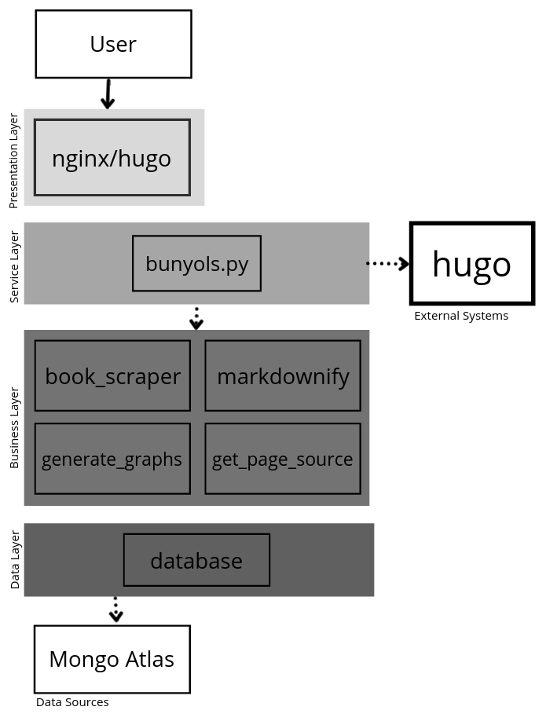

# Bunyols

# Introduccion

**Bunyols Library** nace con la idea de presentar la información basica que cualquier libro debe de tener. Unicamente información representativa sobre el libro en si de una forma muy facil para el usuario. 

# Historia

Nuestro tran llamativo nombre surgio de un dia ir caminando por Palma de Mallorca y una mujer en un puesto de estos aceitosos y sabrosas frutas fritas regalarme una bolsa de 1kg totalmente gratis. No era capaz de comerme tal semejante cantidad de [*fruta de sarten*](https://es.wikipedia.org/wiki/Bu%C3%B1uelo) y asi fue como Samuele comio bunyols de camino al tren, dentro del tren y de desayuno al siguiente dia. De nada Samu, atentamente Eze.

# Metodologia

Para la parte logica de la aplicación se ha utilizado una **metodologia incremental** utilizando la filosofia de construir funcionalidades del programa, analizandolo y construyendo incrementos donde uno unido al otro tiene el fin de construir un uso funcional de la aplicación.

Para la parte de diseño web se ha utilizado una **metodologia prototipada** donde hemos diseñado diferentes prototipos de la pagina en diferentes fomatos *(papel y [software grafico](https://www.figma.com/)).* Una vez elegido el diseño, se recreo en HTML y CSS pasandolo por ultimo a **hugo**.


# Analisis

 ## Arquitectura

 

- **Presentation layer**
    - **nginx/hugo** el primero es un software de servidor web open source utilizado para servir archivos HTML que construira la segunda tecnologia.

- **Service layer** 
  - **bunyols.py** programa principal.

- **Business layer**
  - **get_page_source** encargado de hacer peticiones y general el contenido parseado de la pagina web solicitada.
  - **book_scraper** encargado de obtener los datos estaticos y dinamicos de la pagina web en la que se solicite la accion.
  - **markdownify** encargado de crear el *frontmatter* utilizado por Hugo asi de generar la estructura de los items devueltros por `book_scrapper`.
  - **generate_graphs** encargado utilizando los datos dinamicos proporcionados por `get_page_source` de generar graficos con el numero de reviews y cambios en el precio que seran presentados en la pagina final del libro.

 - **Data layer**
    - **database** todo lo relacionado a acciones hechas sobre y con la base de datos **MongoDB** con instrucciones de la libreria `pymongo.`


## Tecnologias y herramientas

- **[Python](https://docs.python.org/3/)**
  - **Beautiful Soup 4** es una biblioteca de Python para extraer datos de archivos HTML y XML dejando a elegir el parser para proporcional formas de navegacion, busqueda y modificación. [Referencia](https://www.crummy.com/software/BeautifulSoup/bs4/doc/)
  - **requests** es una libreria HTTP para Python utilizada para realizar peticiones HTTP y hacermas mas amigables.
    [Referencia](https://docs.python-requests.org/en/latest/)
  - **fake-headers** usada para generar una cabecera aleatoria para enmascarar diferentes peticiones y que no vengan bloqueadas.
 [Referencia](https://pypi.org/project/fake-headers/)
   - **matplotlib** es una libreria para crear animaciones estaticas y visualizaciones interactivas en Python. [Referencia](https://matplotlib.org/stable/)
  - **pytest** es un framework utilizado para escribir casos test y poner aprueba aplicaciones y librerias. [Referencia](https://docs.pytest.org/en/6.2.x/)
  - **coverage** junto a *pytest* es una herramienta para medir el codigo cubierto de un prograna. Monitoriza el programa informando de que cantidad de codigo ha sido ejecutada. [Referencia](https://coverage.readthedocs.io/en/6.2/)


- **[MongoDB](https://docs.mongodb.com/)**
  - **pymongo** es una libreria que contiene herramientas para trabajar con [MongoDB](http://www.mongodb.org/). [Referencia](https://pymongo.readthedocs.io/en/stable/)
- **[Hugo](https://gohugo.io/documentation/)**
  - *Framework* utilizado para la creacion de sitios webs estaticos.
- **HTML5 y CSS**
  - Estilizacion de la parte web junto a hugo.
- **[Git](https://git-scm.com/docs)**
  - Realización de cambios y subida de versiones modificadas independientes, no sobrescribiendo en el archivo original.
- **Markdown**
  - Lenguaje de marcado ligero utilizado en **gohugo**


# Diseno
## Mapa Conceptual

## Esquema de la Base de Datos
### Esquema MongoDB
```json
{
    "title": {
        "type": "string",
        "description": "Book's Title"
    },
    "author": {
        "type": "array",
        "description": "List of authors of the book"
    },
    "publisher": {
        "type": "string",
        "description": "Entity that published the book"
    },
    "ISBN_13": {
        "type": "string",
        "description": "Unique book's identifier"
    },
    "publish_date": {
        "type": "string",
        "description": "Day when the book was published"
    },
    "price": {
        "type": "array",
        "items": {
            "type": "object",
            "properties": {
                "value": {
                    "type": "string",
                    "description": "Current price of the book"
                },
                "date": {
                    "type": "string",
                    "description": "The date of when the price was retrived"
                }
            }
        },
        "description": "Array of object contaning the book price and the day the price was retrived"
    },
    "reviews": {
        "type": "object",
        "properties": {
            "total_reviews": {
                "type": "number",
                "description": "Total number of reviews of the book"
            },
            "5": {
                "type": "number",
                "description": "Total number of 5 star reviews"
            },
            "4": {
                "type": "number",
                "description": "Total number of 4 star reviews"
            },
            "3": {
                "type": "number",
                "description": "Total number of 3 star reviews"
            },
            "2": {
                "type": "number",
                "description": "Total number of 2 star reviews"
            },
            "1": {
                "type": "number",
                "description": "Total number of 1 star reviews"
            }
        }
    },
    "categories": {
        "type": "array",
        "items": {
            "type": "string",
            "description": "Category name"
        },
        "description": "Array of categories of the book"
    },
    "family": {
        "type": "string",
        "description": "Saga/Collection of which the book is part of"
    }
}
```

### Ejemplo Real
```json
{
    "title": "Code Complete",
    "author": [
        "Steve McConnell"
    ],
    "publisher": "Microsoft Press",
    "ISBN_13": "9780735619678",
    "publish_date": "June 2004",
    "price": [
        {"date": "2021-12-06 18:13:33", "value": "$16.43"},
        {"date": "2021-12-10 00:24:26", "value": "$29.99"},
    ],
    "reviews": {
        "total_reviews": 896, 
        "5": 699, 
        "4": 117, 
        "3": 45, 
        "2": 17, 
        "1": 18
    },
    "categories": ["IT"],
}
```

## Pruebas a Realizar

# Implementacion

# Pruebas

# Comparacion Temporal

## Clockify
Para tener bajo control el tiempo utilizado y para poder comparar nuestras estimaciones hemos usado la herramienta Clockify con las siguentes etiquetas:
- Scraper: Para los modulos *book_scraper* y *get_page_source*
- Database: Para el modulo *database* y la creacion del esquema y validacion de la base de datos
- Web Design: Para el prototipado de la pagina web (tanto diseno como implementacion HTML)
- Hugo: Para la configuracion de *Hugo* y para la implementacion del prototipo
- Markdown: Para los modulos *markdownify* y *generate_graphs*
- Docs: Para el tiempo usado para escribir esta documentacion
- Cofiguracion: Para la configuracion de git y para la configuracion de herramientas y scripts (git-hooks, tox, pytest, etc...)
### 

# Dificultades